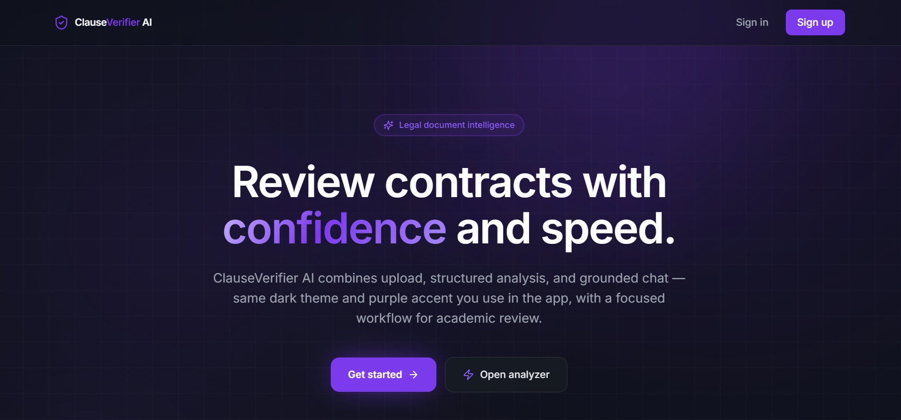
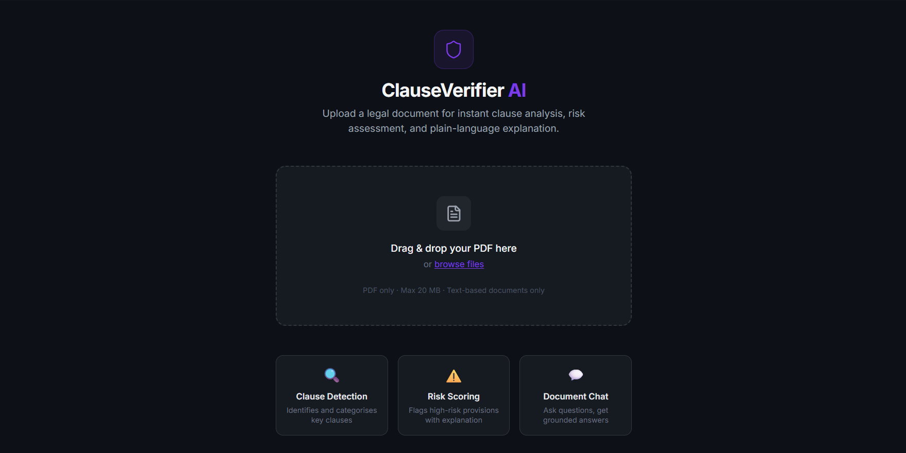
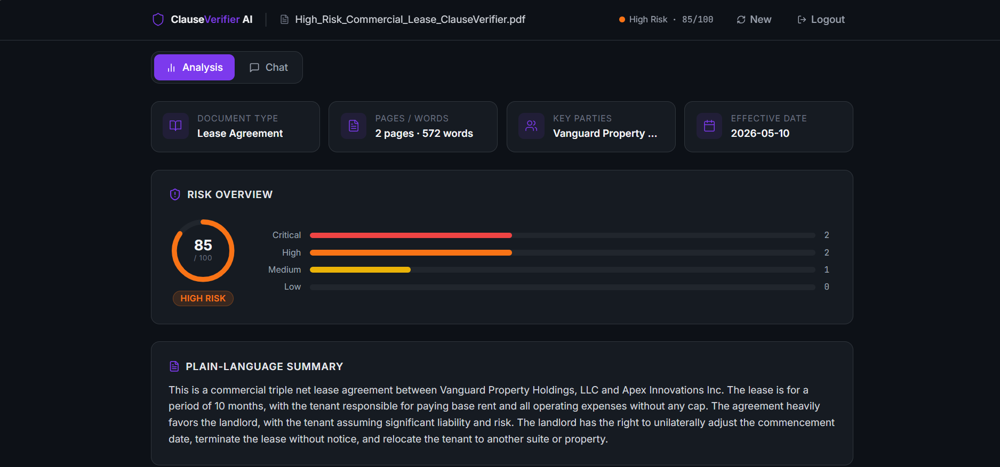
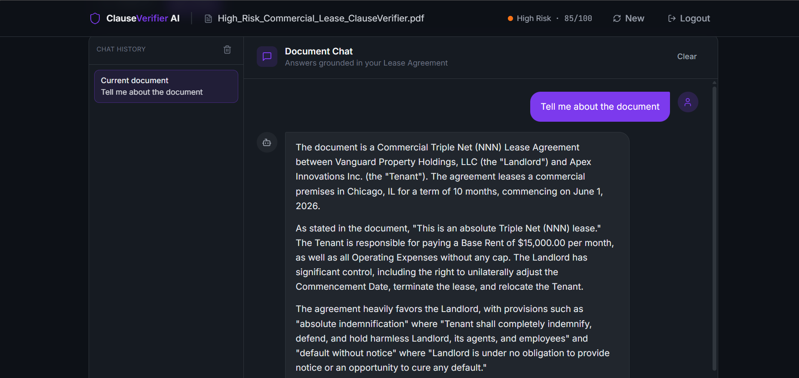
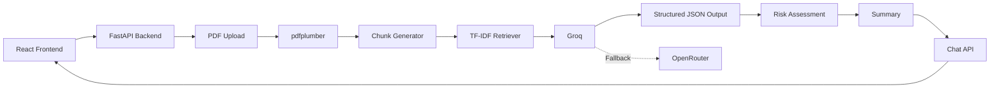
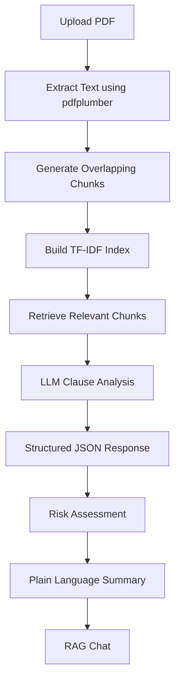

# ClauseVerifier AI

**AI-Powered Legal Document Analysis & Contract Intelligence Platform**

ClauseVerifier AI is a full-stack AI-powered legal document analysis platform that enables users to upload machine-readable PDF contracts and receive structured legal insights using Large Language Models (LLMs).

The platform automatically extracts contractual clauses, categorizes them, evaluates potential risks, generates plain-language summaries, and provides document-grounded question answering through Retrieval-Augmented Generation (RAG).

> **Disclaimer**
>
> ClauseVerifier AI is intended for educational, research, and demonstration purposes. It does **not** constitute legal advice and should not replace review by a qualified legal professional.

---

# Project Overview

Legal contracts often contain lengthy and complex language that makes reviewing them time-consuming and error-prone.

ClauseVerifier AI simplifies this process by combining traditional Natural Language Processing techniques with modern Large Language Models to create an intelligent contract analysis workflow.

After uploading a machine-readable PDF, the platform:

* Extracts text from the document
* Segments the document into overlapping chunks
* Retrieves relevant context using TF-IDF similarity
* Uses LLMs to identify and classify important clauses
* Performs clause-level risk assessment
* Computes an overall document risk score
* Generates an easy-to-understand summary
* Enables users to ask natural language questions grounded in the uploaded document

The system has been designed with a modular architecture, making it easy to extend with additional AI providers, retrieval strategies, authentication mechanisms, and persistent storage.

---

# Key Features

| Feature                  | Description                                                   |
| ------------------------ | ------------------------------------------------------------- |
| PDF Upload               | Upload machine-readable legal contracts                       |
| Text Extraction          | Extract clean text using pdfplumber                           |
| Clause Identification    | Detect major contractual provisions                           |
| Clause Categorization    | Organize clauses into legal categories                        |
| Risk Assessment          | Evaluate clause-level and document-level risks                |
| Risk Score               | Overall document risk scoring                                 |
| Plain Language Summary   | Generate simplified contract explanations                     |
| Retrieval-Augmented Chat | Ask questions grounded in the uploaded document               |
| Structured AI Responses  | JSON-based LLM outputs for consistent parsing                 |
| Provider Fallback        | Automatically fall back from Groq to OpenRouter when required |
| Fast API Backend         | High-performance asynchronous REST API                        |
| Modern React UI          | Responsive frontend built with React and Tailwind CSS         |

---

# Application Preview

| Landing Page                      | Upload Documents                 |
| --------------------------------- | -------------------------------- |
|  |  |

| Contract Analysis                  | Document Chat                  |
| ---------------------------------- | ------------------------------ |
|  |  |

---

# Technology Stack

## Backend

| Technology  | Purpose              |
| ----------- | -------------------- |
| FastAPI     | REST API framework   |
| Python 3.11 | Backend language     |
| pdfplumber  | PDF text extraction  |
| Pydantic    | Data validation      |
| HTTPX       | HTTP client          |
| Groq SDK    | Primary LLM provider |

---

## Frontend

| Technology   | Purpose             |
| ------------ | ------------------- |
| React 18     | User Interface      |
| Vite         | Development tooling |
| Tailwind CSS | Styling             |

---

## AI

| Technology | Purpose                     |
| ---------- | --------------------------- |
| Groq       | Primary inference provider  |
| OpenRouter | Automatic fallback provider |

---

## Retrieval

| Technology            | Purpose                             |
| --------------------- | ----------------------------------- |
| TF-IDF                | Semantic document retrieval         |
| Word Overlap Chunking | Context preservation between chunks |

---

# System Architecture



---

# AI Workflow



---

# Project Structure

```text
ClauseVerifier-AI/

├── backend/
│   ├── auth/
│   ├── db/
│   ├── middleware/
│   ├── models/
│   ├── routers/
│   ├── services/
│   ├── storage/
│   ├── config.py
│   └── main.py
│
├── frontend/
│   ├── components/
│   ├── pages/
│   ├── services/
│   ├── App.jsx
│   └── LandingPage.jsx
│
├── docs/
│   └── images/
│
└── README.md
```

## Backend

| Folder     | Purpose                          |
| ---------- | -------------------------------- |
| routers    | API endpoints                    |
| services   | Business logic                   |
| storage    | In-memory document storage       |
| auth       | Authentication utilities         |
| middleware | Cross-cutting request middleware |
| db         | Data layer abstraction           |
| models     | Pydantic request/response models |
| config.py  | Configuration management         |
| main.py    | FastAPI application entry point  |

---

## Frontend

| Folder          | Purpose                |
| --------------- | ---------------------- |
| components      | Reusable UI components |
| pages           | Route-level pages      |
| services        | API communication      |
| App.jsx         | Application root       |
| LandingPage.jsx | Public landing page    |

---

# Backend Architecture

The backend follows a layered architecture that separates routing, business logic, storage, configuration, and data models.

### Request Flow

```text
Client Request
      │
      ▼
 FastAPI Router
      │
      ▼
 Service Layer
      │
      ▼
 Document Storage
      │
      ▼
 Retrieval Pipeline
      │
      ▼
 LLM Provider
      │
      ▼
 JSON Response
```

## PDF Text Extraction

The platform uses **pdfplumber** to extract text from machine-readable PDF documents.

Advantages include:

* Accurate extraction of embedded text
* Preservation of reading order
* Lightweight implementation
* No OCR dependency

Scanned PDFs are not currently supported.

---

## Word-Overlap Chunking

Long contracts exceed the context limits of language models.

To preserve semantic continuity, extracted text is divided into overlapping chunks.

Example:

```text
Chunk 1
------------------------
Payment Terms...
Termination...
Confidentiality...

Chunk 2
------------------------
Termination...
Confidentiality...
Liability...
```

Benefits:

* Better context preservation
* Reduced boundary information loss
* Improved retrieval quality

---

## TF-IDF Retrieval

The application builds a TF-IDF representation of document chunks.

When a user submits a question:

1. The query is vectorized.
2. Similarity scores are computed.
3. Top matching chunks are retrieved.
4. Retrieved context is supplied to the LLM.

Advantages:

* Lightweight
* Fast
* No external vector database
* Easy deployment

---

## In-Memory Storage

Uploaded documents are stored temporarily in memory.

Benefits:

* Zero database configuration
* Fast development
* Simplified deployment
* Suitable for demonstrations

Documents are cleared when the server restarts.

---

## JSON Structured LLM Responses

Rather than relying on free-form text, the LLM is instructed to return structured JSON.

Benefits include:

* Predictable parsing
* Reduced post-processing
* Improved frontend rendering
* Consistent API contracts

---

## AI Provider Strategy

### Primary Provider

Groq is used for high-speed inference.

### Automatic Fallback

If Groq is unavailable, requests automatically fall back to OpenRouter.

This improves platform resilience without affecting the user experience.

---

# Frontend Architecture

The frontend is built using React 18 with a component-based architecture.

Responsibilities include:

* Document upload
* Progress indicators
* Analysis visualization
* Risk score presentation
* Clause display
* Chat interface
* API integration

Application Flow

```text
Landing Page

↓

Upload

↓

Analysis

↓

Results

↓

Interactive Chat
```

---

# Installation Guide

## Prerequisites

* Python 3.11+
* Node.js 18+
* npm
* Git

---

## 1. Clone Repository

### Windows PowerShell

```powershell
git clone https://github.com/your-username/ClauseVerifier-AI.git
cd ClauseVerifier-AI
```

### macOS/Linux

```bash
git clone https://github.com/your-username/ClauseVerifier-AI.git
cd ClauseVerifier-AI
```

---

## 2. Create Python Virtual Environment

### Windows PowerShell

```powershell
python -m venv .venv
.venv\Scripts\Activate.ps1
```

### macOS/Linux

```bash
python3 -m venv .venv
source .venv/bin/activate
```

---

## 3. Install Backend Dependencies

### Windows PowerShell

```powershell
cd backend
pip install -r requirements.txt
```

### macOS/Linux

```bash
cd backend
pip install -r requirements.txt
```

---

## 4. Configure Environment Variables

Create a `.env` file inside the `backend` directory.

Example:

```env
GROQ_API_KEY=your_key
OPENROUTER_API_KEY=your_key

GROQ_MODEL=llama-3.3-70b-versatile
OPENROUTER_MODEL=meta-llama/llama-3.3-70b-instruct

MAX_CHUNK_SIZE=800
CHUNK_OVERLAP=150
MAX_CHUNKS_FOR_RETRIEVAL=5

CORS_ORIGINS=http://localhost:5173
```

---

## 5. Run Backend

### Windows PowerShell

```powershell
uvicorn main:app --reload
```

### macOS/Linux

```bash
uvicorn main:app --reload
```

---

## 6. Install Frontend Dependencies

### Windows PowerShell

```powershell
cd ../frontend
npm install
```

### macOS/Linux

```bash
cd ../frontend
npm install
```

---

## 7. Run Frontend

### Windows PowerShell

```powershell
npm run dev
```

### macOS/Linux

```bash
npm run dev
```

---

## 8. Open the Application

Frontend

```text
http://localhost:5173
```

Backend

```text
http://localhost:8000
```

Swagger UI

```text
http://localhost:8000/docs
```

---

## 9. Verify the Backend

Open:

```text
http://localhost:8000/health
```

A healthy backend should return a successful status response.

---

## 10. Verify the Frontend

Open:

```text
http://localhost:5173
```

You should see the ClauseVerifier AI landing page.

---

## 11. Upload Your First Document

1. Open the upload page.
2. Select a machine-readable PDF.
3. Upload the document.
4. Wait for analysis to complete.

---

## 12. Start Chat

After analysis:

* Open the Chat page.
* Ask questions in natural language.
* Responses will be grounded only in the uploaded document.

---

# Environment Variables

| Variable                 | Description                                |
| ------------------------ | ------------------------------------------ |
| GROQ_API_KEY             | API key for Groq inference                 |
| OPENROUTER_API_KEY       | API key for OpenRouter fallback            |
| GROQ_MODEL               | Primary LLM model                          |
| OPENROUTER_MODEL         | Fallback LLM model                         |
| MAX_CHUNK_SIZE           | Maximum words per chunk                    |
| CHUNK_OVERLAP            | Number of overlapping words between chunks |
| MAX_CHUNKS_FOR_RETRIEVAL | Maximum retrieved chunks for each query    |
| CORS_ORIGINS             | Allowed frontend origins                   |

---

# Application Workflow

```text
PDF Upload
      │
      ▼
Text Extraction
      │
      ▼
Word-Overlap Chunking
      │
      ▼
TF-IDF Index Creation
      │
      ▼
Clause Analysis
      │
      ▼
Risk Assessment
      │
      ▼
Plain Language Summary
      │
      ▼
Grounded Chat
```

---

# API Overview

| Endpoint                      | Method | Description                            |
| ----------------------------- | ------ | -------------------------------------- |
| `/health`                     | GET    | Health check endpoint                  |
| `/api/documents/upload`       | POST   | Upload a PDF document                  |
| `/api/documents/{id}/analyze` | POST   | Analyze an uploaded document           |
| `/api/documents/{id}`         | GET    | Retrieve document details and analysis |
| `/api/chat`                   | POST   | Ask document-grounded questions        |

---

# Design Decisions

## FastAPI

Chosen because:

* Excellent performance
* Native async support
* Automatic OpenAPI documentation
* Strong typing with Pydantic
* Minimal boilerplate

---

## React

Chosen because:

* Component-based architecture
* Efficient UI updates
* Strong ecosystem
* Excellent developer experience

---

## Groq

Chosen because:

* Extremely low inference latency
* High throughput
* Reliable production-grade API
* Well-suited for interactive AI applications

---

## TF-IDF

Chosen instead of vector databases because:

* Lightweight
* No external infrastructure
* Fast retrieval
* Appropriate for single-document analysis

---

## In-Memory Storage

Chosen because:

* Simplifies setup
* Eliminates database dependencies
* Enables rapid experimentation
* Ideal for educational and portfolio demonstrations

---

## Word Overlap Chunking

Chosen because:

* Preserves semantic continuity
* Reduces context fragmentation
* Improves retrieval quality
* Maintains relationships across chunk boundaries

---

## JSON Structured Outputs

Chosen because:

* Predictable schema
* Easier validation
* Reliable frontend rendering
* Simplified parsing
* Reduced prompt ambiguity

---

# Limitations

* Supports only machine-readable PDF documents.
* Scanned PDFs requiring OCR are not supported.
* Documents are stored in memory and are lost when the server restarts.
* TF-IDF retrieval is optimized for single-document analysis rather than large document collections.
* AI-generated analysis may contain inaccuracies and should not be considered legal advice.
* Performance depends on the quality and formatting of the uploaded document.
* Large contracts may require multiple retrieval passes depending on model context limits.

---

# Future Improvements

* Persistent database integration
* OCR support for scanned documents
* Hybrid retrieval with embeddings and vector databases
* Multi-document knowledge bases
* User authentication and role-based access control
* Document versioning and history
* Clause comparison across multiple contracts
* Export analysis to PDF and Microsoft Word
* Streaming LLM responses
* Background task processing for large documents
* Audit logs and activity tracking
* Advanced legal analytics dashboard
* Fine-grained citation highlighting within source documents

---

# License

This project is licensed under the **MIT License**.

See the `LICENSE` file for additional information.

---

# Author

**Devarsh Shah**

AI Engineer | Full-Stack Developer | Machine Learning Enthusiast

---

## Acknowledgements

ClauseVerifier AI brings together modern web technologies, lightweight information retrieval, and large language models to demonstrate an end-to-end approach to intelligent legal document analysis. The project is designed as a practical reference implementation for learning, experimentation, and showcasing full-stack AI application development.
